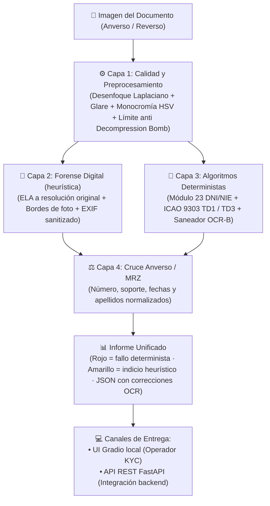

# 🛡️ Hermetic-ID: Detector Local de Inconsistencias Documentales

[](https://www.python.org/)
[](https://opensource.org/licenses/MIT)
[-green.svg)](#-privacidad-y-compliance-rgpd)
[](https://github.com/marcelopereagarcia-sys/Hermetic-ID/actions/workflows/ci.yml)
[](CHANGELOG.md)

Herramienta de código abierto para la **detección de inconsistencias** en documentos de identidad españoles y europeos (DNI 3.0/4.0, NIE, TIE y Pasaportes ICAO Doc 9303 TD1 / TD3).

Diseñada bajo el principio de **Privacy-by-Design**: se ejecuta **en local**, sin telemetría y sin enviar imágenes a servicios externos. El análisis se hace en memoria; las únicas escrituras en disco son las subidas temporales de la interfaz Gradio, confinadas en una carpeta dedicada que se purga automáticamente (ver [Privacidad](#-privacidad-y-compliance-rgpd)).

---

> ## ⚠️ AVISO LEGAL Y DESCARGO DE RESPONSABILIDAD
> 1. **Finalidad**: Este software se publica exclusivamente con fines educativos, de investigación en ciberseguridad, prevención de fraude digital y prefiltrado KYC interno.
> 2. **Límite Técnico**: Esta herramienta analiza imágenes planas y detecta incoherencias matemáticas de algoritmos oficiales, discrepancias de datos e indicios de edición digital. **No certifica ni puede certificar la autenticidad física de un soporte documental** (las medidas de seguridad de nivel 1 como policarbonato, hologramas OVI y grabados láser requieren inspección física o lectura criptográfica del chip NFC).
> 3. **Sin Carácter Oficial**: Esta herramienta **no sustituye** a las verificaciones oficiales de la Dirección General de la Policía (DGP), la Fábrica Nacional de Moneda y Timbre (FNMT) ni a los servicios de consulta autorizados del Estado.
> 4. **Responsabilidad del Operador**: Este repositorio contiene únicamente código fuente para ejecución local. El autor **no almacena, no procesa ni tiene acceso a ningún dato o documento** analizado por los usuarios. Toda persona o entidad que opere este software es la única responsable de disponer de la base legitimadora conforme al RGPD.

---

## 💼 Posicionamiento: Filtro L1 Local

Hermetic-ID no pretende reemplazar a plataformas de verificación de identidad como Onfido, Veriff o Sumsub (verificación de vida certificada, lectura de chip eMRTD, bases de datos de plantillas).

Su función es actuar como **filtro de primer nivel (L1)** antes de esas plataformas:
- Descarta localmente los casos con **inconsistencias demostrables**: letra de DNI/NIE incorrecta, dígitos de control ICAO que no cuadran, datos del anverso que no coinciden con la MRZ o documento caducado.
- Señala para **revisión manual** los indicios heurísticos: posibles ediciones (ELA), software de retoque en metadatos o bordes de foto anómalos.
- **Soberanía de datos**: los documentos descartados en primer nivel nunca salen de la infraestructura propia.

> **Sin métricas de eficacia todavía.** El proyecto no se ha evaluado contra un conjunto de documentos reales etiquetados, así que no publica tasas de detección ni de falsos positivos. Medirlas es el siguiente paso del [roadmap](#-roadmap).

---

## 🧱 Arquitectura Técnica por Capas

El sistema no usa modelos de lenguaje para decidir sobre datos estructurados: combina controles deterministas (demostrables) con indicios forenses heurísticos (orientativos), y los trata de forma distinta en el veredicto.



### Política de severidad del veredicto

| Tipo de control | Ejemplos | Resultado si falla |
| :--- | :--- | :--- |
| **Determinista** | Dígitos de control ICAO, letra módulo 23, cruce anverso/MRZ, caducidad | 🔴 **FALLO** → "Inconsistencias detectadas" |
| **Heurístico** | ELA, software de edición en EXIF, borde de la foto | 🟡 **ADVERTENCIA** → "Revisión manual" |
| **Calidad** | Desenfoque, reflejos, resolución | 🟡 **ADVERTENCIA** |

Los controles heurísticos nunca marcan un documento en rojo por sí solos: sus umbrales no están calibrados contra imágenes reales y producen falsos positivos (fotos de móvil recomprimidas, capturas de pantalla, recortes hechos con un editor).

### 1. Control de Calidad y Preprocesamiento Fotográfico
- **Protección DoS**: Límite de descompresión `Image.MAX_IMAGE_PIXELS = 25_000_000` y límite dimensional `(6000, 6000)`.
- **Detección de desenfoque**: Varianza del operador Laplaciano.
- **Reflejos especulares (Glare)**: Porcentaje de píxeles sobreexpuestos.
- **Detección de fotocopias monocromáticas**: Saturación media en espacio HSV ($\mu_S < 5.0$).
- **Binarización adaptativa**: Filtrado bilateral y umbralización Otsu para fuentes OCR-B.

### 2. Análisis Forense de Imagen (indicios heurísticos)
- **Error Level Analysis (ELA)**: Recompresión JPEG en memoria (`io.BytesIO`) **a la resolución original de la imagen** —redimensionar antes destruiría la rejilla de compresión que el ELA analiza— con Z-score por bloques (`cv2.boxFilter`). Solo el mapa térmico de visualización se reduce a 1920 px.
- **Halo naranja**: zonas oscuras sin ruido de sensor (texto sólido impreso o trazos digitales planos). Es una ayuda visual para el revisor, no un veredicto.
- **Análisis de gradientes en el contorno de la foto**: Detección de bordes de recorte artificialmente nítidos.
- **Metadatos EXIF**: Se leen de los **bytes originales del archivo** subido y se escapan (`html.escape`) antes de mostrarlos. Detecta firmas de software de edición (Photoshop, GIMP, Canva…).

### 3. Algoritmos Oficiales Españoles e Internacionales
- **DNI Español**: Algoritmo Módulo 23 según el Real Decreto 1553/2005.
- **NIE Extranjeros**: Normalización de prefijos `X=0, Y=1, Z=2` y validación de letra de control.
- **ICAO Doc 9303 TD1 (3 líneas x 30 caracteres — DNI 3.0/4.0 y TIE)**, con la estructura real del documento español:

  ```text
  IDESPBAA0000018 12345678Z<<<<<<   ← línea 1 (espacio añadido solo para leerlo)
  │ │  │        │ └ datos opcionales: DNI/NIE del titular (letra módulo 23 verificada)
  │ │  │        └ dígito de control del soporte
  │ │  └ número de documento = número de SOPORTE (IDESP)
  │ └ país emisor
  └ tipo de documento
  ```

  - Dígitos de control 7-3-1 del soporte, la fecha de nacimiento, la caducidad y el compuesto general.
  - Letra módulo 23 del DNI/NIE codificado en la MRZ (`MRZ_PERSONAL_NUMBER_CHECKSUM`).
  - Rechazo controlado de caracteres fuera del juego ICAO (`A-Z`, `0-9`, `<`).
- **ICAO Doc 9303 TD3 (2 líneas x 44 caracteres — Pasaportes)**: dígitos individuales, datos opcionales y compuesto sobre 39 caracteres.
- **Saneador contextual OCR-B**: Corrección de confusiones típicas solo en ranuras estrictamente numéricas (`O`→`0`, `I`→`1`, `Z`→`2`, `S`→`5`, `B`→`8`).

### 4. Cruce Anverso / MRZ
- **Número de documento**: igualdad exacta con el DNI/NIE de la MRZ (o con el número de pasaporte en TD3).
- **Número de soporte**: el leído en el anverso frente al campo de documento de la MRZ.
- **Fechas** de nacimiento y caducidad.
- **Apellidos**: extraídos de las etiquetas del anverso (o introducidos a mano), normalizados a la transliteración ICAO (`GARCÍA MUÑOZ` ≡ `GARCIA<MUNOZ`) y comparados por palabras. Si el anverso solo aporta el primer apellido, el control pasa pero se marca como **coincidencia parcial**.
- Solo se cruzan datos que proceden del anverso (manuales u OCR). Si solo se sube el reverso, no hay cruce.

### 5. Trazabilidad de las correcciones OCR
Toda corrección heurística aplicada al texto leído por el OCR (prefijo NIE, relleno `<`, longitud de línea, sexo ilegible) queda registrada en el informe (`ocr_corrections`) y en la pestaña de trazabilidad. La corrección del prefijo NIE solo se acepta si la MRZ resultante supera **a la vez** la letra módulo 23 y el dígito compuesto; un DNI correcto nunca se modifica. El sexo no tiene dígito de control, así que un carácter ilegible no se adivina: se marca como no especificado.

---

## 🔒 Privacidad y Compliance (RGPD)

- **Sin telemetría**: `GRADIO_ANALYTICS_ENABLED=False`, interfaz ligada a `127.0.0.1` y `share=False`.
- **Procesamiento en memoria**: el análisis (ELA, EXIF, OCR, MRZ) trabaja sobre buffers en RAM (`BytesIO`).
- **Subidas de la interfaz Gradio**: Gradio guarda en disco cada imagen subida (no ofrece alternativa en memoria). Hermetic-ID las confina en una carpeta dedicada (`GRADIO_TEMP_DIR`, por defecto `%TEMP%/hermetic_id_uploads`) y:
  - borra las subidas con más de **5 minutos** (comprobación cada minuto);
  - vacía la carpeta al arrancar, al cerrar y al pulsar **"Nuevo Expediente / Limpiar"**.
- **API REST**: las subidas se mantienen en RAM (se eleva el umbral de volcado a disco de Starlette por encima del tamaño máximo admitido) y las peticiones demasiado grandes se rechazan antes de leerse.
- **Modelos de OCR**: EasyOCR descarga sus modelos de internet la **primera vez** que se usa. Para un funcionamiento estrictamente offline, descárgalos antes y arranca con `HERMETIC_OFFLINE_MODE=true` (la imagen Docker ya los incluye y arranca en modo offline).
- **Cumplimiento RGPD**: Art. 5 (minimización y limitación del plazo de conservación), Art. 9 (sin almacenamiento de plantillas biométricas faciales) y Art. 32 (seguridad del tratamiento en infraestructura propia).
- **Catálogo de Referencia**: Medidas físicas oficiales contrastables con el registro europeo [PRADO (Consejo de la UE)](https://www.consilium.europa.eu/prado/).

---

## 🌐 API REST Headless (FastAPI)

### Iniciar el microservicio API

```bash
uvicorn src.api.main:app --host 127.0.0.1 --port 8000
```

### Configuración por variables de entorno

| Variable | Por defecto | Efecto |
| :--- | :--- | :--- |
| `HERMETIC_API_KEY` | *(sin definir)* | Si se define, los endpoints `/api/v1/audit/*` exigen la cabecera `X-API-Key`. **Obligatoria si la API escucha fuera de `127.0.0.1`.** |
| `HERMETIC_CORS_ORIGINS` | *(ninguno)* | Orígenes web permitidos, separados por comas. Sin definir, ningún navegador de otro origen puede leer las respuestas. |
| `HERMETIC_OFFLINE_MODE` | `false` | `true` impide que EasyOCR descargue modelos. |
| `HERMETIC_MODELS_DIR` | `~/.EasyOCR/model` | Carpeta de los modelos de OCR. |

### Endpoints Disponibles

| Método | Endpoint | Descripción |
| :--- | :--- | :--- |
| `GET` | `/health` / `/api/v1/health` | Estado de salud, versión y flag de modo offline (público). |
| `POST` | `/api/v1/audit/document-number` | Verificación algorítmica de DNI o NIE español. |
| `POST` | `/api/v1/audit/mrz` | Validación y decodificación de bloque MRZ (TD1 o TD3), con `personal_number` y `support_number`. |
| `POST` | `/api/v1/audit/document` | Auditoría completa multipart (anverso + reverso + campos opcionales). Máx. 25 MB por imagen. |

### Ejemplo: Validación de DNI / NIE

```bash
curl -X POST http://127.0.0.1:8000/api/v1/audit/document-number \
     -H "Content-Type: application/json" \
     -d '{"document_number": "12345678Z"}'
```

Respuesta:
```json
{
  "is_valid": true,
  "document_type": "DNI",
  "document_number": "12345678Z",
  "expected_letter": "Z",
  "actual_letter": "Z",
  "details": "Letra de control verificada con éxito."
}
```

### Ejemplo: Validación de Pasaporte TD3 (2 líneas x 44 caracteres)

```bash
curl -X POST http://127.0.0.1:8000/api/v1/audit/mrz \
     -H "Content-Type: application/json" \
     -d '{
       "lines": [
         "P<UTOERIKSSON<<ANNA<MARIA<<<<<<<<<<<<<<<<<<<",
         "L898902C36UTO7408122F1204159ZE184226B<<<<<10"
       ]
     }'
```

---

## 🚀 Instalación y Puesta en Marcha

### Requisitos
- Python 3.10 o 3.11.

```bash
# 1. Clonar el repositorio
git clone https://github.com/marcelopereagarcia-sys/Hermetic-ID.git
cd Hermetic-ID

# 2. Crear y activar entorno virtual
python -m venv .venv
# En Windows:
.\.venv\Scripts\activate
# En Linux/macOS:
source .venv/bin/activate

# 3. Instalar paquete en modo desarrollo
pip install -e ".[dev]"

# 4. Lanzar la aplicación web interactiva (Gradio)
python app.py
```

Acceso al portal web local: `http://127.0.0.1:7860`.

---

## 🐳 Despliegue con Docker

```bash
docker compose -f docker/docker-compose.yml up --build
```

Acceso: `http://127.0.0.1:7860`. Si ese puerto está ocupado (por ejemplo, por la app ejecutándose en local), elige otro con `HERMETIC_HOST_PORT`:

```bash
HERMETIC_HOST_PORT=7870 docker compose -f docker/docker-compose.yml up --build
```

- Dentro del contenedor la aplicación escucha en `0.0.0.0` (`HERMETIC_HOST`); si escuchara en `127.0.0.1`, el mapeo de puertos no llegaría a ella.
- La exposición real la limita `docker-compose.yml`, que publica el puerto **solo en el loopback del host** (`127.0.0.1:7860:7860`).
- La imagen (≈3 GB) instala PyTorch solo CPU, incluye los modelos de OCR y arranca con `HERMETIC_OFFLINE_MODE=true`: en ejecución no descarga nada.
- Se ejecuta con un usuario sin privilegios (`appuser`).
- `.dockerignore` excluye `.venv`, `.git` y cualquier imagen o PDF local, para que ningún documento de prueba acabe dentro de la imagen.

---

## 🧪 Suite de Pruebas Automatizadas

El repositorio cuenta con **91 pruebas unitarias y de integración**, todas con datos sintéticos marcados como `SPECIMEN`:

```bash
pytest -v tests/
```

Salida esperada:
```text
tests/test_algorithms.py ..................                              [ 19%]
tests/test_api.py ...........                                            [ 31%]
tests/test_forensics.py ....                                             [ 36%]
tests/test_ocr_crosscheck.py .......                                     [ 43%]
tests/test_preprocessor.py .......                                       [ 51%]
tests/test_regressions.py ....................................           [ 91%]
tests/test_reporting_and_ui.py ........                                  [100%]
============================= 91 passed =============================

Cobertura: 87 % (el CI exige un mínimo del 75 %).
```

`tests/test_regressions.py` reproduce los fallos corregidos en la revisión del 2026-10-06 (ver [CHANGELOG.md](CHANGELOG.md)) usando la estructura real de la MRZ española y un OCR simulado, para que no vuelvan a aparecer.

Integración Continua configurada en [`.github/workflows/ci.yml`](.github/workflows/ci.yml) para Python 3.10 y 3.11.

---

## 🚧 Limitaciones Conocidas

- **Umbrales heurísticos sin calibrar**: los umbrales del ELA y del borde de foto se ajustaron con muy pocas imágenes. Hasta medirlos contra un conjunto de imágenes etiquetado, son indicios para revisión manual.
- **Recuadro de la foto estimado**: el control de borde asume que la imagen es un recorte ajustado del documento (la foto se busca en proporciones fijas). En una foto con fondo, el recuadro no coincidirá.
- **OCR del anverso**: apellidos y nombre se extraen de las etiquetas impresas (`PRIMER/SEGUNDO APELLIDO`, `APELLIDOS / SURNAMES`, `NOMBRE / NAME`). Está probado con lecturas OCR simuladas; si un campo no se extrae bien, introdúcelo manualmente en "Parámetros Manuales".
- **ELA y formato de origen**: el ELA solo tiene sentido sobre imágenes JPEG. En PNG o capturas de pantalla el resultado no es interpretable.
- **Sin verificación del chip**: la verificación criptográfica por NFC está en el [roadmap](#-roadmap).

---

## 🗺️ Roadmap

- [ ] **Medición**: conjunto de imágenes etiquetado (auténticas y manipuladas; móvil, escáner y capturas) para calibrar el ELA y el borde de foto y publicar tasas reales de detección y falsos positivos.
- [ ] **OCR del anverso con documentos reales**: validar la extracción de apellidos y nombre con anversos reales de DNI 3.0, DNI 4.0 y TIE.
- [ ] **Recuadro de la foto**: localizarlo detectando el documento en lugar de usar proporciones fijas.
- [ ] **ELA según formato**: avisar o desactivarlo cuando la imagen de origen no es JPEG.
- [ ] **Verificación por chip NFC**: lectura local del chip del DNI 3.0/4.0 vía PC/SC (PACE con CAN) y validación de la firma de la Policía Nacional.

Historial de versiones en [CHANGELOG.md](CHANGELOG.md).

---

## 📄 Licencia

Este proyecto está bajo la Licencia **MIT**. Consulta el archivo [LICENSE](LICENSE) para más detalles.
